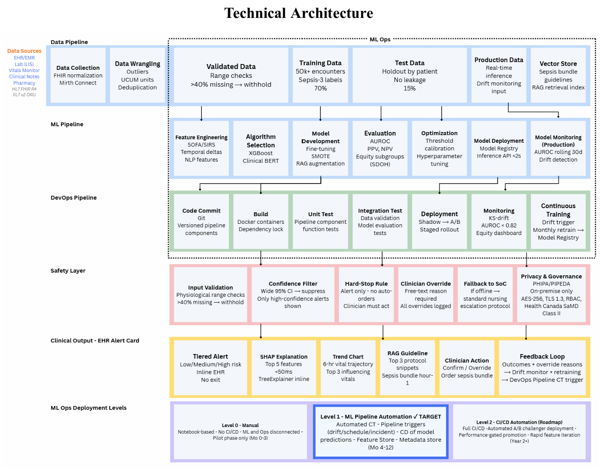

# Sepsis Early Warning & Prediction System

## Overview
A multi-pipeline clinical decision support system designed to predict 
sepsis onset using structured EHR data.

## Architecture
The system comprises three integrated pipelines:
- **Data Pipeline** — HL7 FHIR R4/v2 for data ingestion and standardization
- **ML Pipeline** — XGBoost for structured data + Clinical BERT for 
  clinical notes
- **MLOps Pipeline** — Automated retraining and model monitoring

## Tools & Technologies
- HL7 FHIR R4/v2
- XGBoost
- Clinical BERT
- Python

## Status
Academic/portfolio project
